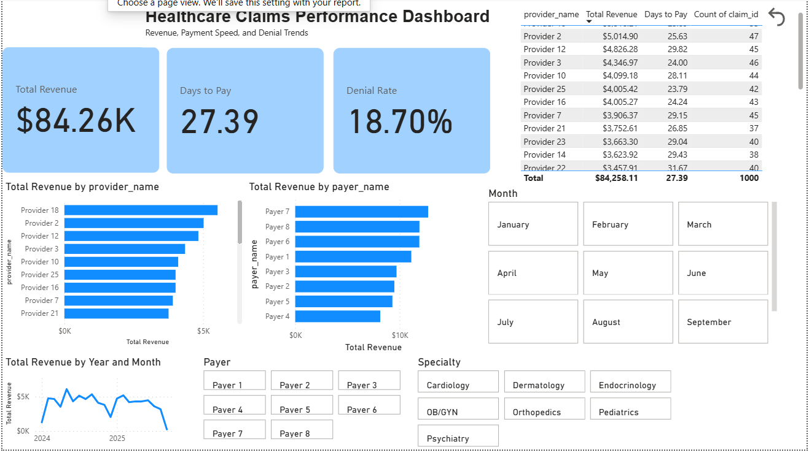

# Healthcare Claims Performance Dashboard (Power BI)

## 📌 Overview
This project analyzes a simulated dataset of healthcare claims to uncover trends in **revenue**, **payment speed**, and **denial rates** by payer and provider.  
The dashboard provides actionable insights for identifying top-performing payers, bottlenecks in payment processing, and areas with high denial rates.

---

## 🎯 Key Business Question
> Which payers and providers drive the most revenue, pay the fastest, and have the lowest denial rates — and how does this change over time?

---

## 🛠 Features
- **Multi-table data model** connecting claims, payments, payers, and providers  
- **DAX measures** for:
  - Total Revenue
  - Average Days to Pay
  - Denial Rate
- **Interactive visuals** including bar charts, line charts, KPI cards, and slicers
- **Reset Filters button** to quickly return to the default view
- Clean, business-ready dashboard design

---

## 📂 Files
- `Healthcare_Claims_Dashboard.pbix` – Power BI dashboard file  
- `/data` – Dataset in CSV format:  
  - `claims.csv`  
  - `payers.csv`  
  - `providers.csv`  
  - `payments.csv`  

---

## 🚀 How to Use
1. Download the `.pbix` file and open in **Power BI Desktop** (free).  
2. Explore the dashboard using slicers for payer type, specialty, and month.  
3. Click the **Reset Filters** button to return to the default view.  

---

## 📊 Skills Demonstrated
- Data modeling in Power BI  
- Calculated columns and DAX measures  
- Interactive dashboard design  
- KPI creation and visualization  
- Data storytelling and operational performance analysis

---

## 📈 Tools Used
- **Power BI Desktop**  
- **DAX** for custom calculations  
- **CSV dataset** generated with Python  

---

## 📬 Contact
If you’d like to discuss this project or similar work, feel free to connect on [LinkedIn](https://www.linkedin.com).
